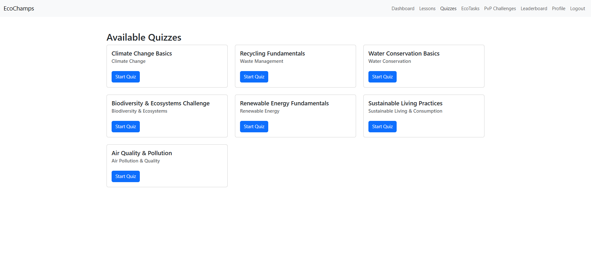

# 🌱 EcoChamps 
A Gamified Learning platform where users can learn about the environment, take quizzes, complete eco-friendly tasks,PvP together and compete on the leaderboard.
EcoChamps makes learning about the environment fun and interactive.  
Users can:
- Learn through lessons 📝
- Take quizzes and challenges 🧠
- Complete eco-friendly tasks 🌍
- Earn XP, levels, and badges 🏆
- Compete in PvP challenges ⚔️
- Track progress on the leaderboard 📊
## 🚀 Tech Stack
- **Frontend**: React, TypeScript, React Router, Bootstrap
- **Backend**: Node.js, Express (planned)
- **Database**: MongoDB (planned)
## 📸 Screenshots

## Updates Coming Soon
